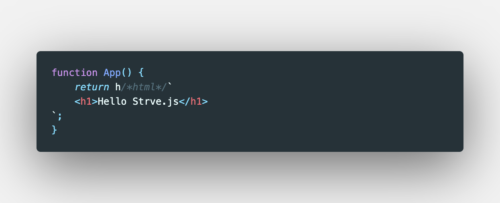

# Other

## IDE support

### Visual Studio Code 

- template string auto-completion tags

Open `settings.json` under Settings and add the following code:

```json
"emmet.triggerExpansionOnTab": true,
"emmet.showAbbreviationSuggestions": true,
"emmet.showExpandedAbbreviation": "always",
"emmet.includeLanguages": {
    "javascript": "html"
}
```

- Support HTML template string highlighting

After downloading the [es6-string-html](https://marketplace.visualstudio.com/items?itemName=Tobermory.es6-string-html) plugin, add `/*html*/ in the middle of the `render``` method `.

```js
function App() {
    return render/* html */`
        <div class='inner'>
            <p>${state.msg}</p>
        </div >
    `;
}
```
Just like that, in the VSCode editor, this plugin can make HTML template characters highlighted.



## UI framework

- Bootstrap5

[https://getbootstrap.com/](https://getbootstrap.com/)

- Tailwindcss

[https://tailwindcss.com/](https://tailwindcss.com/)

## Browser Compatibility

Because the Strve.js project build tool is built with [Vite](https://vitejs.dev/) by default, the default build target browser can support native ESM and native ESM dynamic import on the script tag. Legacy browsers can be supported through the official plugin `@vitejs/plugin-legacy`.

For example:
```js
import { defineConfig } from 'vite';
import legacy from '@vitejs/plugin-legacy'

export default defineConfig({
  // options
  server: {
    strictPort:true,
    port: 3001
  },
  plugins: [
    legacy({
      targets: ['ie >= 9'],
      additionalLegacyPolyfills: ['regenerator-runtime/runtime']
    })
  ]
});
```

## Change Log

### v2.3.3

- Parameter adjustment of `Strve` API;

### v2.3.2

- HTML tag content supports displaying non-string types;
- The `${}` symbol is used for data binding, and the `{}` symbol is no longer supported;
- View templates support multiple root nodes;
- View template supports Text node;
- Fixed switching states during conditional rendering, and nodes could not be rendered correctly;
- Added `watchDOMChange` API for monitoring DOM tree changes;
- Added support for HTML template string highlighting (VSCode editor needs to install `es6-string-html` plugin);
- Remove the `data` attribute parameter of the `Strve` API;
- View templates support Class writing;

### v2.3.1

- Modify some error messages;

### v2.3.0

- Added version number `strveVersion` API;
- Modify the internal logic of `updateView` API;

### v2.2.0

- Support SVG elements;
- Optimize internal diff algorithm;
- Add necessary error prompt;
### v2.1.0

- Fixed the problem that the DOM attribute property could not be assigned;
- Improve the logical problem of converting strings to virtual DOM;
### v2.0.0

- Inserting data into the head of the list needs to bind the `useFkey` field to avoid repeated rendering of the `DOM` node;

- Hide the `DOM` node event method after rendering;
   
- Bind the `Style` style (object);
   
- The binding properties are uniformly bound using the `${}` symbol;
   
- Support HTML template string highlighting (VSCode editor needs to install `comment-tagged-templates` plugin);
   
- Support parent and child components to pass values to each other;

- Adapt to Bootstrap5、Tailwindcss UI framework;

## About the author

- Name:**Vam**
- ID:**maomincoding**
- Github:[https://github.com/maomincoding](https://github.com/maomincoding)
- Twitter:[https://twitter.com/maomincoding](https://twitter.com/maomincoding)
